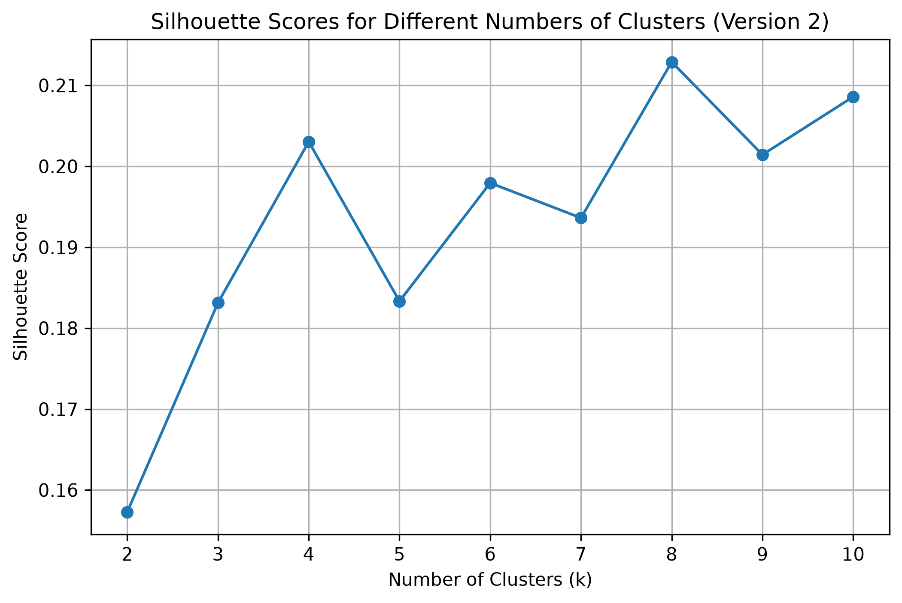
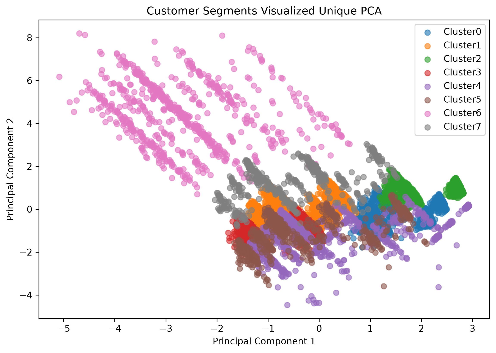
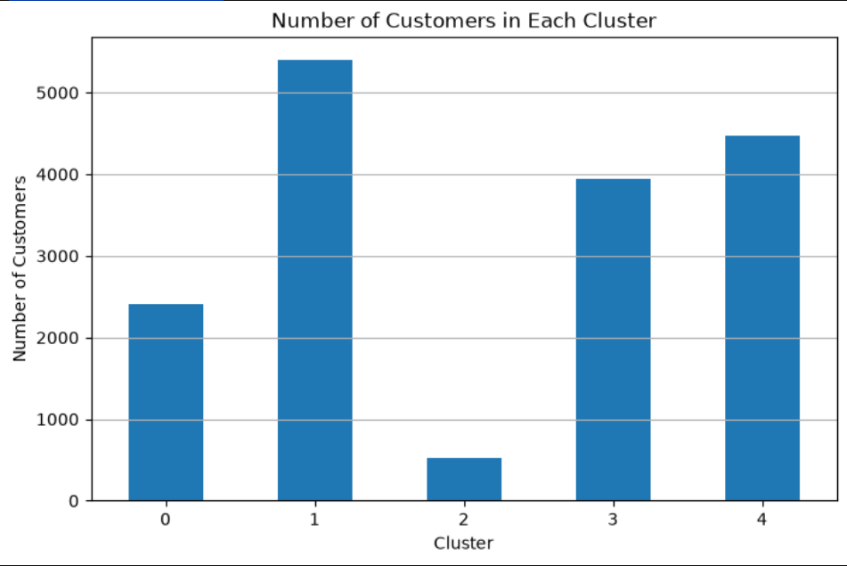
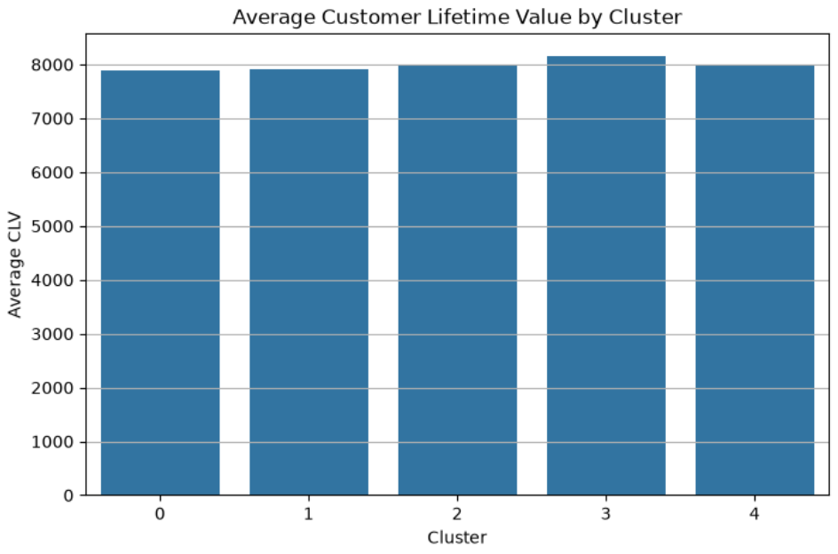

# 📊 Customer Segmentation Analysis using Machine Learning

An end-to-end Machine Learning project that applies **K-Means Clustering** to identify meaningful customer segments based on demographic, financial, loyalty, and enrollment characteristics.

The project covers the complete Machine Learning lifecycle:

> **Data → Analysis → Feature Engineering → Clustering → Evaluation → Model Serialization → Web Application → Deployment**

The final application allows users to enter customer information and receive a real-time customer segment prediction, cluster match score, business insights, and recommended actions.

---

## 🚀 Live Demo

🔗 **Streamlit Application:** Coming Soon

---

## 📌 Project Overview

Understanding customer behavior is essential for businesses that want to improve customer retention, personalize marketing campaigns, and allocate resources more effectively.

This project uses **unsupervised Machine Learning** to group customers with similar characteristics into distinct behavioral segments.

The final system uses a trained **K-Means clustering model** to assign new customers to the most representative cluster based on their input characteristics.

---

## 🎯 Business Objectives

Customer segmentation can help businesses:

- Improve customer retention
- Personalize marketing campaigns
- Identify high-value customer groups
- Increase Customer Lifetime Value (CLV)
- Improve customer engagement
- Allocate resources more effectively
- Develop targeted customer strategies

---

## ✨ Application Features

The deployed Streamlit application provides:

- 🔍 Real-time customer segment prediction
- 🤖 K-Means clustering model inference
- ⚙️ Automatic input preprocessing
- 📏 Feature scaling using a saved `StandardScaler`
- 🎯 Cluster match score
- 📊 Distance to cluster center
- 💡 Business insights for each customer segment
- ✅ Recommended business actions
- 🕒 Prediction history
- 🔬 Technical details showing processed and scaled features
- 📈 PCA-based cluster visualization

---

## 📊 Dataset

### Customer Loyalty History Dataset

The dataset contains customer demographic, financial, loyalty, and enrollment information.

Key features include:

- Annual Salary
- Customer Lifetime Value (CLV)
- Gender
- Education
- Marital Status
- Loyalty Card
- Enrollment Type
- Enrollment Year
- Enrollment Month

The original dataset contains **16,737 customer records** and **16 features**.

---

## 🧠 Machine Learning Workflow

### 1. Data Loading and Assessment

The dataset was inspected to understand:

- Dataset structure
- Feature types
- Missing values
- Data distributions
- Potential data quality issues

### 2. Data Cleaning

Missing values and inconsistent data were handled before modeling.

### 3. Exploratory Data Analysis

Exploratory analysis was performed to understand:

- Customer demographics
- Salary distribution
- Customer Lifetime Value
- Enrollment patterns
- Loyalty behavior
- Relationships between customer characteristics

### 4. Feature Engineering

Relevant numerical and categorical features were selected and transformed for Machine Learning.

### 5. One-Hot Encoding

Categorical variables were transformed into numerical representations using One-Hot Encoding.

### 6. Feature Scaling

Features were standardized using `StandardScaler` to ensure that variables with larger numerical ranges did not dominate the clustering algorithm.

### 7. K-Means Clustering

The K-Means algorithm was used to group customers into **8 distinct clusters**.

### 8. Cluster Evaluation

The optimal clustering structure was evaluated using:

- Elbow Method
- Silhouette Score

### 9. Cluster Profiling

Each cluster was analyzed to identify its defining characteristics and assign meaningful business interpretations.

### 10. PCA Visualization

Principal Component Analysis (PCA) was used to reduce the high-dimensional feature space to two dimensions for visualizing the customer clusters.

### 11. Model Serialization

The trained Machine Learning artifacts were saved using Joblib:

- K-Means model
- Feature scaler
- Feature column structure

### 12. Deployment

The trained model was integrated into an interactive Streamlit Web Application for real-time predictions.

---

## 📈 Exploratory Analysis

The project includes several visual analyses:

### Elbow Method

Used to evaluate the relationship between the number of clusters and within-cluster variation.


### Silhouette Score

Used to evaluate the quality and separation of the resulting clusters.



### PCA Cluster Visualization

A two-dimensional visualization of the customer clusters after applying Principal Component Analysis.



### Customers per Cluster



### Average Customer Lifetime Value by Cluster



### Average Salary by Cluster


### Cluster Characteristics Heatmap


---

## 🧪 Project Evolution

This repository contains two major iterations of the project.

### Version 1

The first version focused on the core analytical workflow:

- Dataset assessment
- Data cleaning
- Exploratory Data Analysis
- Feature engineering
- K-Means clustering
- Cluster evaluation
- Cluster profiling

### Version 2

The second version extended the project into a complete end-to-end Machine Learning application by adding:

- Refined preprocessing pipeline
- PCA visualization
- Model serialization
- Saved preprocessing artifacts
- Streamlit Web Application
- Real-time customer segment prediction
- Business insights and recommended actions
- Prediction history
- Production-style deployment

---

## 🛠️ Tech Stack

### Programming Language

- Python

### Data Science and Machine Learning

- Pandas
- NumPy
- Scikit-learn
- Joblib

### Visualization

- Matplotlib
- Seaborn

### Web Application

- Streamlit

### Development Tools

- Jupyter Notebook
- Visual Studio Code
- Git
- GitHub

---

## 📁 Project Structure

```text
Customer-Segmentation-Analysis/
│
├── app.py
├── README.md
├── requirements.txt
├── .gitignore
│
├── data/
│   └── Customer Loyalty History.csv
│
├── images/
│   ├── average_clv_by_cluster.png
│   ├── average_salary_by_cluster.png
│   ├── cluster_characteristics_heatmap.png
│   ├── customers_per_cluster.png
│   ├── elbow_method.png
│   ├── pca_visualization.png
│   └── silhouette_score.png
│
├── models/
│   ├── feature_columns.pkl
│   ├── kmeans_model.pkl
│   └── scaler.pkl
│
├── notebooks/
│   ├── Customer Segmentation Analysis v1.ipynb
│   └── Customer Segmentation Analysis v2.ipynb
│
└── utils/
    ├── preprocessing.py
    └── segments.py