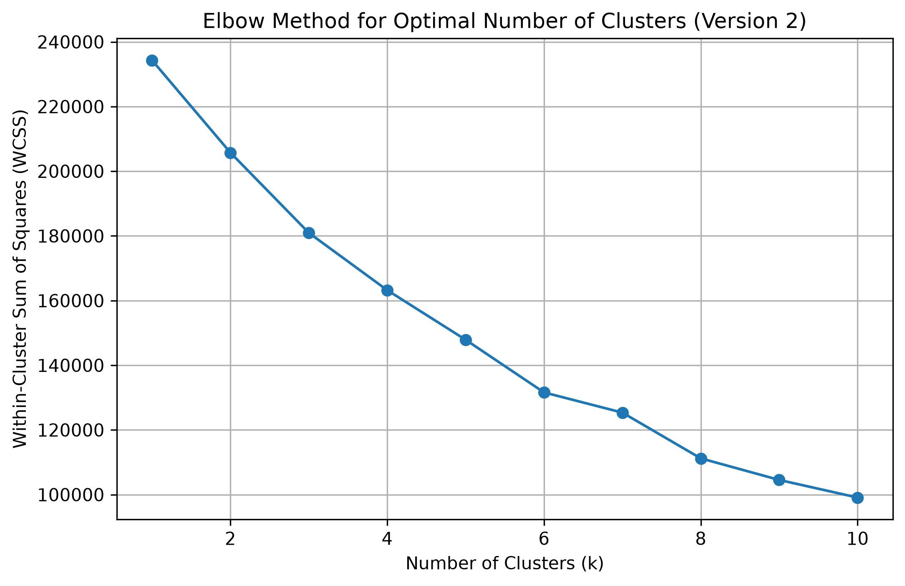
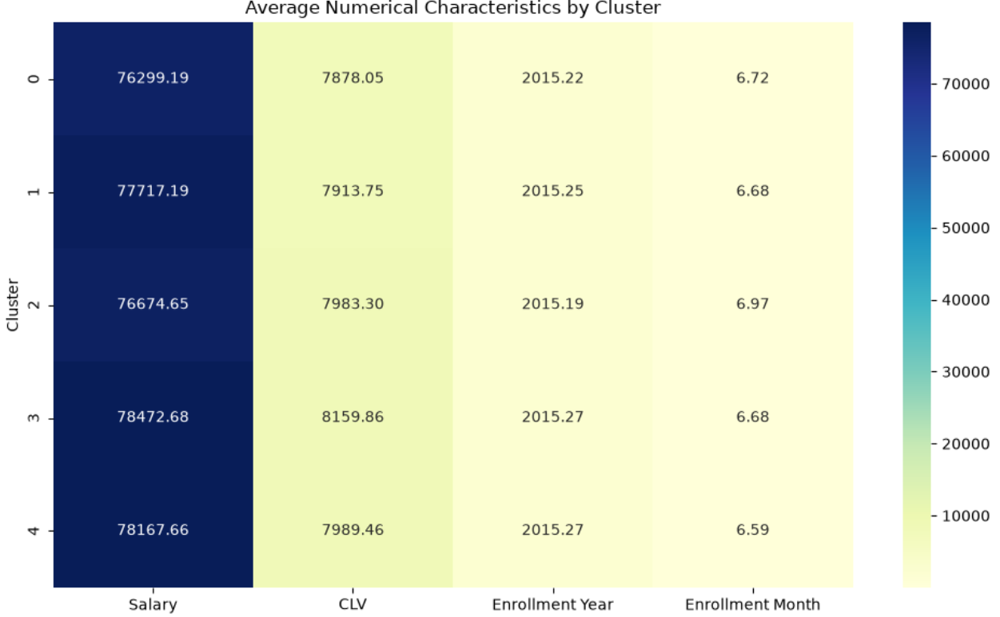
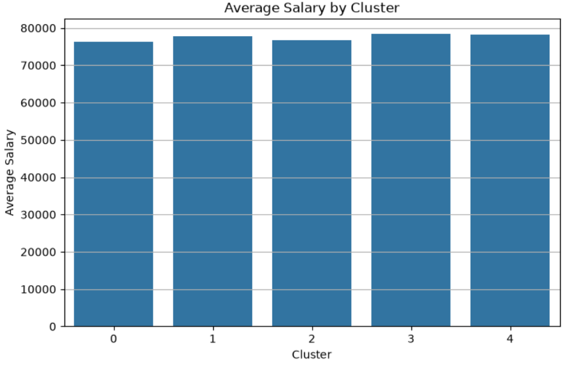

# ✈️ Customer Segmentation Analysis using Machine Learning

> An end-to-end customer segmentation project that applies **K-Means Clustering** to analyze airline loyalty customers and generate actionable business insights. This project is actively evolving toward a deployable interactive web application.


---

# 📖 Project Overview

Customer segmentation enables businesses to better understand their customers by identifying groups with similar characteristics and behaviors. These insights support personalized marketing, improved customer retention, and data-driven business decisions.

In this project, customer data from an **Airline Loyalty Program** is analyzed using **K-Means Clustering**. The workflow covers data cleaning, exploratory data analysis, feature engineering, clustering, evaluation, and business interpretation to transform raw customer data into meaningful customer segments.

This repository is an evolving machine learning project. Future updates will extend the analysis into a fully interactive web application where users can upload customer data and generate customer segments in real time.

---

# 🚀 Project Status

| Stage | Status |
|--------|--------|
| Data Cleaning & Preprocessing | ✅ Complete |
| Data Quality Assessment | ✅ Complete |
| Exploratory Data Analysis (EDA) | ✅ Complete |
| Feature Engineering | ✅ Complete |
| Feature Scaling | ✅ Complete |
| K-Means Clustering | ✅ Complete |
| Cluster Evaluation | ✅ Complete |
| Business Insights | ✅ Complete |
| Enhanced Modeling | 🚧 In Progress |
| Web Application | ⏳ Planned |
| Deployment | ⏳ Upcoming |

---

# 🎯 Project Objectives

- Clean and preprocess customer data.
- Assess overall data quality.
- Explore customer demographics and financial behavior.
- Engineer relevant analytical features.
- Standardize selected features for clustering.
- Determine the optimal number of customer segments.
- Build customer segments using K-Means Clustering.
- Interpret each cluster from a business perspective.
- Generate actionable recommendations for marketing and customer retention.
- Deploy the solution as an interactive machine learning application.

---

# 📊 Dataset

The dataset contains customer information from an **Airline Loyalty Program**, including demographic, financial, and loyalty-related attributes.

### Key Features

- Customer Lifetime Value (CLV)
- Salary
- Loyalty Card
- Gender
- Marital Status
- Education
- Enrollment Information
- Flight Activity
- Other demographic and behavioral attributes

The objective is to identify groups of customers with similar characteristics and purchasing behavior to support targeted business strategies.

---

# 🛠 Technologies Used

| Category | Tools |
|-----------|-------|
| Programming | Python |
| Data Analysis | Pandas, NumPy |
| Machine Learning | Scikit-learn |
| Data Visualization | Matplotlib |
| Development | Jupyter Notebook |
| Version Control | Git & GitHub |

---

# 🔄 Project Workflow

1. Data Loading
2. Data Quality Assessment
3. Missing Value Investigation
4. Exploratory Data Analysis
5. Outlier Detection
6. Feature Engineering
7. Feature Selection
8. Feature Scaling using StandardScaler
9. Optimal Cluster Selection using the Elbow Method
10. K-Means Clustering
11. Cluster Evaluation
12. Cluster Profiling
13. Business Insights
14. Business Recommendations

---

# 🤖 Machine Learning

### Algorithm

- K-Means Clustering

### Feature Scaling

- StandardScaler

### Cluster Selection

The **Elbow Method** was used to determine the optimal number of clusters.

The final model identified **five distinct customer segments**, each representing different customer characteristics and business opportunities.

---

# 📈 Key Visualizations

## Elbow Method

The Elbow Method was used to determine the optimal number of customer clusters.



---

## Cluster Characteristics Heatmap

Comparison of the average numerical characteristics across customer clusters.



---

## Average Customer Lifetime Value by Cluster

Comparison of the average Customer Lifetime Value (CLV) across all identified customer segments.


---

## Average Salary by Cluster

Comparison of the average salary across customer segments.



---

## Number of Customers in Each Cluster

Distribution of customers across the five identified clusters.


---

# 💡 Key Business Insights

The clustering analysis identified **five distinct customer segments**, each with unique financial characteristics and customer lifetime values.

Key observations include:

- High-value customers are concentrated within specific clusters, making them ideal candidates for premium loyalty programs.
- Lower-value customer groups present opportunities for targeted promotions and engagement campaigns.
- Salary alone does not fully explain customer value, demonstrating the importance of multi-feature segmentation.
- Differences in cluster sizes provide insights into the composition of the customer base and opportunities for personalized marketing.

---

# 📈 Business Recommendations

Based on the identified customer segments, organizations can:

- Develop personalized marketing campaigns for each customer segment.
- Prioritize retention strategies for high-value customers.
- Design loyalty programs tailored to premium customer groups.
- Increase engagement among lower-value customers through targeted promotions.
- Optimize marketing budgets using data-driven customer segmentation.

---

# 📂 Repository Structure

```text
Customer-Segmentation-Analysis/
│
├── Customer Segmentation Analysis.ipynb
├── README.md
├── requirements.txt
├── LICENSE
├── .gitignore
│
├── data/
│   └── Customer Segmentation.csv
│
├── images/
│   ├── average_clv_by_cluster.png
│   ├── average_salary_by_cluster.png
│   ├── cluster_characteristics_heatmap.png
│   ├── customers_per_cluster.png
│   └── elbow_method.png
│
├── app/                 # Planned
└── models/              # Planned
```

---

# 🚀 Future Roadmap

This project will continue evolving through the following milestones:

### Version 2

- Improve feature engineering.
- Compare K-Means with additional clustering algorithms.
- Improve cluster profiling.
- Optimize model performance.

### Version 3

- Build an interactive Streamlit web application.
- Allow users to upload customer data for segmentation.
- Deploy the application to the cloud.
- Improve documentation and testing.
- Create a production-ready customer segmentation tool.

---

# 💼 Skills Demonstrated

- Data Cleaning
- Data Quality Assessment
- Exploratory Data Analysis (EDA)
- Feature Engineering
- Feature Scaling
- Unsupervised Machine Learning
- K-Means Clustering
- Cluster Evaluation
- Business Analytics
- Data Visualization
- Python Programming
- Git & GitHub

---

# ⚙️ Installation

Clone the repository:

```bash
git clone https://github.com/Bangaly-DS/Customer-Segmentation-Analysis.git
```

Navigate to the project directory:

```bash
cd Customer-Segmentation-Analysis
```

Install the required dependencies:

```bash
pip install -r requirements.txt
```

Launch Jupyter Notebook:

```bash
jupyter notebook
```

Open:

```text
Customer Segmentation Analysis.ipynb
```

---

# 📌 Project Evolution

This project is being developed iteratively.

### ✅ Current Release

- Data preprocessing
- Data quality assessment
- Exploratory Data Analysis
- Feature Engineering
- K-Means Clustering
- Customer Segmentation
- Cluster Evaluation
- Business Insights

### 🚧 Next Release

- Enhanced clustering workflow
- Additional clustering algorithm comparison
- Improved feature engineering

### 🚀 Final Goal

A fully deployed machine learning web application that enables users to upload customer data, generate customer segments, and visualize business insights interactively.

---

# 👨‍💻 Author

**Bangaly Sano**

📧 **Email:** sanobangaly@hotmail.com

🔗 **LinkedIn:** https://linkedin.com/in/sano-bangaly-064535146

💻 **GitHub:** https://github.com/Bangaly-DS

---

## ⭐ Support

If you found this project useful, consider giving it a ⭐ on GitHub. Feedback, suggestions, and contributions are always welcome.
